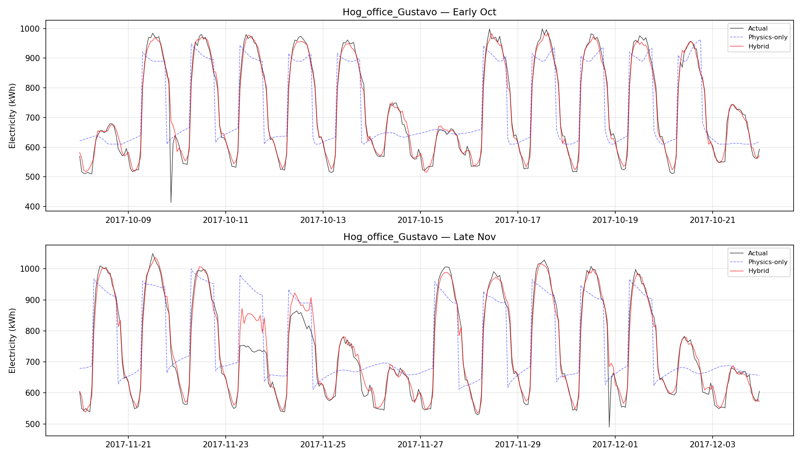
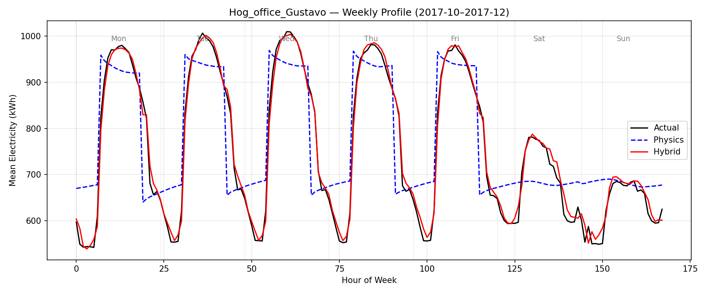

# Building Energy Digital Twin

Hybrid physics-ML model that predicts hourly electricity consumption for a 6,582 m² office building. Combines a 3R2C thermal network (physics) with a neural correction network (ML) to achieve R² = 0.970. Includes a Streamlit dashboard with what-if scenario engine.

**[Live Dashboard](https://building-energy-twin.streamlit.app)**

## Results

| Model | RMSE (kWh) | MAE (kWh) | MAPE | R² |
|-------|-----------|----------|------|-----|
| Mean baseline | 162.7 | 147.3 | 20.3% | 0.000 |
| Schedule (hour-of-week avg) | 37.4 | 25.2 | 3.5% | 0.947 |
| Physics-only (RC + degree-hours) | 90.6 | 72.5 | 10.4% | 0.690 |
| NN-only | 33.8 | 19.8 | 2.7% | 0.957 |
| **Hybrid (ours)** | **28.0** | **16.8** | **2.4%** | **0.970** |

Hybrid improves over physics-only by 69% (RMSE) and over NN-only by 17%.


*Two-week test windows: hybrid (red) tracks actual (black) through daily cycles and weekend dips*


*Average weekly profile: hybrid captures the hourly shape that physics misses*

## Architecture

```
E_predicted = E_physics(RC thermal model) + NN_correction(features)
```

### Physics Component
- **3R2C lumped-parameter model** simulates free-floating indoor temperature from weather
- Parameters scaled from 200 m² reference to actual 6,582 m² building (R ∝ 1/area, C ∝ area)
- Degree-hours converted to energy: `E = 7.7·CDH + 4.2·HDH + 890·occupied + 610·unoccupied`

### ML Correction
- **MLP** (64→32→1) trained on residuals (actual - physics prediction)
- **13 features:** cyclical time encoding, weather, free-floating temperature, physics prediction, 3 lagged residuals
- Learns occupancy patterns, equipment cycling, and effects that first principles cannot model

## Data

- **Source:** [Building Data Genome Project 2](https://github.com/buds-lab/building-data-genome-project-2) (open data)
- **Building:** Hog_office_Gustavo (office, 6,582 m², Minnesota — extreme climate -29°C to 36°C)
- **Discovery:** 2016 data anomalous (mean 308 kWh) vs 2017 (mean 756 kWh) — used 2017 only
- **Split:** Jan-Sep train (6,551 hours), Oct-Dec test (2,208 hours)

## What-If Scenario Engine

The Streamlit dashboard enables physically-grounded scenario analysis:
- **Temperature offset** (-10 to +10°C) — simulate climate change impacts
- **Cooling/heating setpoints** — quantify energy savings from setpoint adjustments
- **Occupancy schedules** — compare standard, 4-day week, extended hours, 24/7
- **Cost impact** — automatic $/kWh calculation

This is what makes the hybrid approach valuable: the physics backbone enables extrapolation to unseen conditions that a pure ML model cannot handle.

## Project Structure

```
src/
  physics/rc_model.py       # 3R2C thermal network model + calibration
  ml/correction.py          # ResidualCorrectionNet (PyTorch MLP)
  hybrid/twin.py            # BuildingDigitalTwin orchestrator
  pipeline/data_loader.py   # BDG2 data loading, solar/internal gain estimation
train.py                    # End-to-end training pipeline
dashboards/app.py           # Streamlit dashboard with what-if engine
```

## Quick Start

```bash
pip install -r requirements.txt

# Download BDG2 dataset into data/raw/bdg2/

# Train
python train.py

# Dashboard
PYTHONPATH="." streamlit run dashboards/app.py
```

## Tech Stack

- **PyTorch** — neural correction network
- **scikit-learn** — energy scaling regression, feature normalization
- **Streamlit + Plotly** — interactive dashboard with what-if scenarios
- **CoolProp** principles — RC thermal model for building physics

## Part of the Physical AI Portfolio

This is Project 4 of a 7-project portfolio proving physics-informed AI skills across thermal systems, energy, structural mechanics, HVAC, pipe networks, rotating machinery, and CFD.
